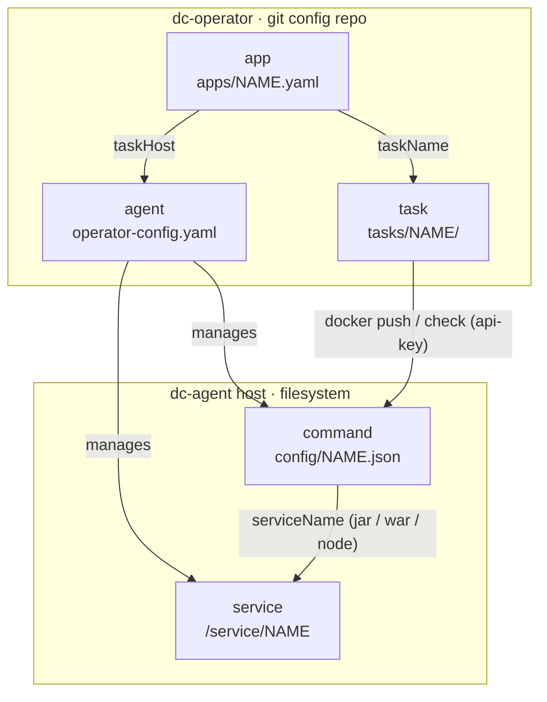

The system is built from five resources: **app**, **agent**, **task**, **service**, and **command**.
They live in two different places and are connected across the operator → agent boundary.

## Two config stores

- **Operator config repo** (a git repo, `REPO_DIR`) — the [dc-operator](/dc-agent/tools/dc-operator/)'s source of
  truth. Holds the **agent** fleet (`operator-config.yaml`), the **apps** (`apps/<name>.yaml`), and the **tasks**
  (`tasks/<name>/`).
- **Agent filesystem** — on each [dc-agent](/dc-agent/internals/architecture/#dc-agent-app--the-agent) host. Holds
  the **commands** (`config/<name>.json`) and the **services** (daemontools dirs under `/service/<name>`).

The operator never touches an agent's disk directly — it reaches each host only over HTTP, on the three
separately-tokened channels described in [Architecture](/dc-agent/internals/architecture/#the-token-channels).

## How they relate

## Resources

### agent

A single **dc-agent** host in the fleet the operator manages. Agents are listed statically in
`operator-config.yaml`; the operator never discovers them dynamically.

- **Lives in:** operator config repo — one entry in `operator-config.yaml`.
- **Fields:** `name`, `url`, and three secrets — `token` (deploy `api-key`), `cpToken` (control-plane `Bearer`),
  `appStatusToken` (status `Bearer`).
- **Hosts:** many commands and many services (both on the agent's own filesystem).

### app

A named deployment binding that says *"deploy this task to this host."* One file `apps/<appName>.yaml`.

- **Lives in:** operator config repo — `apps/<name>.yaml`.
- **Fields:** `appName`, `taskName`, `taskType`, `taskHost`.
- **References:** a **task** (by `taskName`) and an **agent** (by `taskHost`). By convention the file name equals
  `appName`, `taskHost` must match an agent `name`, and `taskName` must be a directory under `tasks/`.

### task

The deployment definition itself — a directory `tasks/<taskName>/` of config files. The operator zips the
directory and pushes it to the agent chosen by the app's `taskHost`.

- **Lives in:** operator config repo — `tasks/<name>/` (e.g. a `dc-docker.yml` describing the image, volumes,
  directories and args).
- **Type:** a `TaskType` (`DOCKER`, `JAR`, `WAR`, `NODE`, `ZIP_ARCHIVE`, …). Today the operator only pushes **DOCKER**
  tasks — `docker/push` applies the definition, `docker/check` is a dry-run/diff.
- **References:** targets the agent named by the app's `taskHost`; the push is authorized by that agent's
  `dc-docker` **command** (see below). Many apps may point at the same task.

### service

A [daemontools](/dc-agent/configuration/)-supervised process on an agent — one directory `/service/<serviceName>`
with a `supervise/` state dir.

- **Lives in:** agent filesystem — under `SERVICES_DIR` (`/service`).
- **Fields:** a supervise state (`UP`, `DOWN`, `UP_PAUSED`, …), pid, and timing, read from `supervise/status`.
- **Managed via:** the control-plane channel — list, and up / down / hangup / terminate.
- **Related to commands:** a `deploy jar/war/node` command carries a `serviceName`; deploying it stops, swaps the
  artifact, and restarts the matching service.

### command

An agent-side config file `config/<name>.json` that backs a persistent, `api-key`-guarded deploy endpoint
(`/dc-agent/<type>/<name>`). CI POSTs an artifact to it with the matching `api-key`.

- **Lives in:** agent filesystem — `CONFIG_DIR` (`./config`).
- **Types & fields (vary by type):**
  [deploy jar](/dc-agent/commands/deploy-jar/) / [war](/dc-agent/commands/deploy-war/) /
  [node](/dc-agent/commands/deploy-node/) (`jarFilename`/`warFilename`, `serviceName`, `waitUrl`),
  [save-artifact](/dc-agent/commands/save-artifact/) (`dir`, `extension`),
  [zip-archive](/dc-agent/commands/zip-archive/) / [zip-dirs](/dc-agent/commands/zip-dirs/) (`dir`),
  [fetch-url](/dc-agent/commands/fetch-url/) and [docker](/dc-agent/commands/docker/) (fixed names `fetch-url` /
  `dc-docker`). Every command carries an `apiKeys` map (secret → owner label; secrets are never read back).
- **References:** belongs to one **agent**; a jar/war/node command targets one **service** (`serviceName`). Commands
  are edited from the operator over the control-plane channel.

## Task vs command

These two look similar (both use the `TaskType` vocabulary) but sit on opposite sides of the boundary:

- A **task** is an *operator-side* deployment definition in the git repo, referenced by an app. The operator zips it
  and pushes it to an agent (`docker/push` / `docker/check`), authenticating with the agent's `token`.
- A **command** is an *agent-side* config file that exposes a durable, `api-key`-guarded endpoint. CI (or the
  operator's docker push) calls it to deliver an artifact; jar/war/node commands then restart a service.

The docker flow is where they meet: an app-push of a `DOCKER` task hits the agent's `docker/push`, and the agent's
`dc-docker` command is what authorizes that call's `api-key`.

## Summary

| Resource | Store | References | Cardinality |
| --- | --- | --- | --- |
| **agent** | operator repo (`operator-config.yaml`) | — | operator 1 → N agents |
| **app** | operator repo (`apps/`) | task (`taskName`), agent (`taskHost`) | app 1 → 1 task, 1 → 1 agent |
| **task** | operator repo (`tasks/`) | agent (via app's `taskHost`) | task 1 → N apps |
| **service** | agent filesystem (`/service/`) | — | agent 1 → N services |
| **command** | agent filesystem (`config/`) | agent (host); service (`serviceName`, jar/war/node) | agent 1 → N commands; command → 0..1 service |
